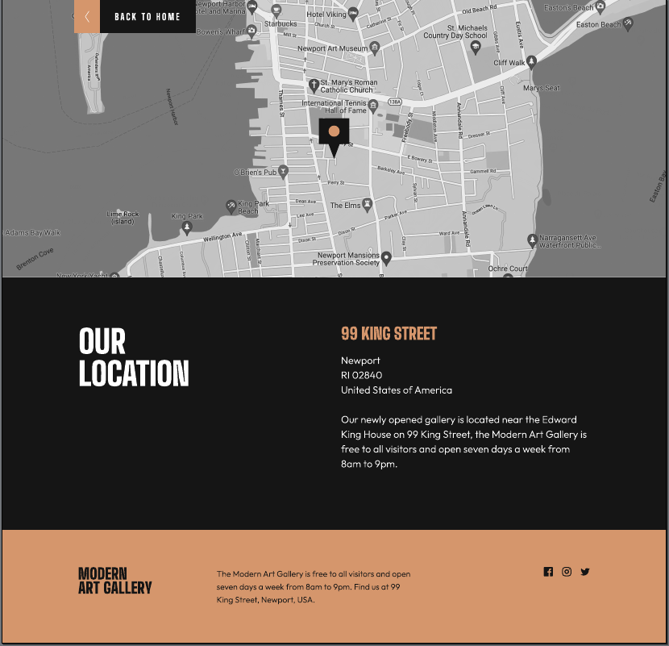

# Microsite Modern Art Gallery
## CSS Tarea entregable 3 – Microsite Modern Art Gallery 
Este proyecto pertenece a las tareas evaluables del Master de desarrollo Fullstack de Conquer Blocks.
Se trata de un proyecto con dos páginas (index.html y location.html) responsive y tres vistas, Mobile First, Tablet y Desktop:
- 1ª Vista Mobile (Smartphone), resolución 375px (como ejmplo Iphone XR o similar).
- 2ª Vista para Tablet, resolución 768px (como ejemplo Ipad Air o similar).
- 3ª Vista para Desktop, resolución a 1440px (no se adapta bien a grandes o muy grandes monitores, como los de 37").
### Puedes verlo en pages, en el siguiente enlace:
  [Microsite Modern Art Gallery](https://dclair.github.io/Microsite-Modern-Art-Gallery/)\
  
   
